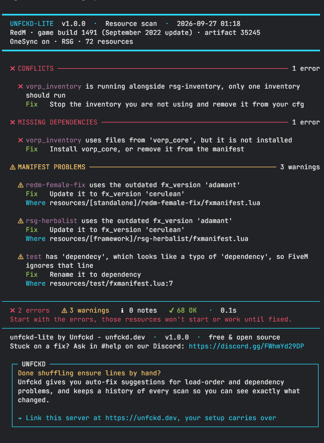

<div align="center">

# unfckd-lite

**Free resource scanner for FiveM & RedM.**
Finds missing dependencies, broken manifests, load-order problems and resource conflicts.
Works with every framework.

[](LICENSE)
[](https://discord.gg/FWhmYd29DP)
[](../../releases)

[Website](https://unfckd.dev) · [Discord](https://discord.gg/FWhmYd29DP) · [Report a bug](../../issues)

</div>



## Why

"Why won't my server start?" usually comes down to the same few problems: a missing dependency, a broken `fxmanifest.lua`, resources started in the wrong order, or two scripts fighting over the same job. unfckd-lite finds them for you in seconds, so you can stop digging through console spam.

## What it looks like

```text
━━━━━━━━━━━━━━━━━━━━━━━━━━━━━━━━━━━━━━━━━━━━━━━━━━━━━━━━━━━━━━━━━━━━━━━━━━━━━━━━
  UNFCKD-LITE  v1.0.0  ·  Resource scan  ·  2026-09-26 21:04
  FiveM · game build 3258 (Bottom Dollar Bounties) · artifact 7290
  OneSync on · QBCore · 184 resources
━━━━━━━━━━━━━━━━━━━━━━━━━━━━━━━━━━━━━━━━━━━━━━━━━━━━━━━━━━━━━━━━━━━━━━━━━━━━━━━━

  ✖ CONFLICTS ────────────────────────────────────────────────────────── 1 error

    ✖ qb-target is running alongside ox_target, only one target should run
      Fix   Stop the target you are not using and remove it from your cfg

  ✖ MISSING DEPENDENCIES ─────────────────────────────────────────────── 1 error

    ✖ qb-garages requires 'qb-vehiclekeys', but it is not installed
      Fix   Install qb-vehiclekeys, or remove it from the manifest

  ⚠ LOAD ORDER ─────────────────────────────────────────────────────── 1 warning

    ⚠ qb-core started before ox_lib, which it uses but does not list as a
      dependency
      Fix   Add dependency 'ox_lib' to its manifest, so FiveM always starts
            ox_lib first
      Where resources/[qb]/qb-core/fxmanifest.lua

  ⚠ MANIFEST PROBLEMS ──────────────────────────────────────────────── 1 warning

    ⚠ old-hud uses the deprecated __resource.lua
      Fix   Rename it to fxmanifest.lua and add fx_version 'cerulean' and a game
            line
      Where resources/[standalone]/old-hud/__resource.lua

────────────────────────────────────────────────────────────────────────────────
  ✖ 2 errors   ⚠ 2 warnings   ℹ 0 notes   ✔ 180 OK   ·  0.4s
  Start with the errors, those resources won't start or work until fixed.
────────────────────────────────────────────────────────────────────────────────
  unfckd-lite by Unfckd - unfckd.dev  ·  v1.0.0  ·  free & open source
  Stuck on a fix? Ask in #help on our Discord: https://discord.gg/FWhmYd29DP

  ┌─ UNFCKD ───────────────────────────────────────────────────────────────────┐
  │ 2 errors today. Next time, know before your players do.                    │
  │ Unfckd alerts you the moment an update breaks something, with an auto-fix  │
  │ suggestion for every problem it finds.                                     │
  │                                                                            │
  │ → Link this server at https://unfckd.dev, your setup carries over          │
  └────────────────────────────────────────────────────────────────────────────┘
```

## Features

- **Missing dependencies:** resources that depend on something that isn't installed or started, or need a newer artifact, game build or OneSync
- **Broken manifests:** manifests so broken that FiveM can't load the resource at all, syntax errors like a missing comma, misspelled keys like `clinet_scripts`, values FiveM silently ignores, and outdated or incomplete `fxmanifest.lua` files
- **Wrong game:** FiveM-only resources on a RedM server and the other way around, including the default Cfx.re resources
- **Load-order problems:** resources that start before the resources they load files from
- **Conflicts:** duplicate resources and overlapping systems, like two inventories or two target scripts
- **Clear report:** every problem comes with the exact fix and the file it points to, with optional export to text or JSON

Works with ESX, QBCore, Qbox, ox_core, ND, vRP, RedM frameworks and standalone servers.

## Privacy

unfckd-lite runs entirely on your server. It makes **no network requests**, needs **no account** and sends **no data** anywhere. Don't take our word for it: the full source is right here.

## Installation

1. Download the latest release from [Releases](../../releases)
2. Extract it into your `resources` folder, keeping the folder name `unfckd-lite`
3. Add this to your `server.cfg`, above every other `ensure` line:

    ```cfg
    ensure unfckd-lite
    ```

    unfckd-lite learns the start order by watching resources start. Anything that starts before it is left out of the load-order check.

4. Start your server and check the console for the report

## Usage

The scan runs automatically a few seconds after the server starts. Run these in the server console or txAdmin:

| Command         | What it does                                                        |
| --------------- | ------------------------------------------------------------------- |
| `unfckd scan`   | Scans every resource again and prints a fresh report                |
| `unfckd export` | Saves the last report to the `reports/` folder inside `unfckd-lite` |
| `unfckd help`   | Lists the commands                                                  |

The command is restricted, so players can only run it with the `command.unfckd` ace. The report always prints in the server console, never in the game chat:

```cfg
add_ace group.admin command.unfckd allow
```

### Reading the report

Every problem comes with a **Fix** line that tells you what to change, and a **Where** line when the problem points to a specific file.

When a resource can't load at all, for example because of a missing comma in its manifest, FiveM leaves it out completely. unfckd-lite then reads FiveM's own startup messages to report it, with the line to fix and how many resources can't start because of it.

The default Cfx.re resources (from [cfx-server-data](https://github.com/citizenfx/cfx-server-data), like `mapmanager` and `spawnmanager`) skip the manifest checks, because you're not meant to edit them. They're still checked for the right game, so a FiveM-only default on a RedM server shows up.

| Icon | Level   | What it means                                                         |
| :--: | ------- | --------------------------------------------------------------------- |
|  ✖   | Error   | Something is broken. The resource won't start or won't work properly. |
|  ⚠   | Warning | It works for now, but it's likely to cause problems. Worth fixing.    |
|  ℹ   | Note    | A small improvement. Nothing is broken.                               |

The header shows your game, the game build with its update name (from `sv_enforceGameBuild`), your artifact, OneSync state, framework and resource count. Paste the whole report when you ask for help, that's usually everything we need.

## Configuration

All options live in `config.lua`. Invalid values are reported in the console at startup and replaced with the default, so a typo never breaks the scanner.

| Option                | Default | What it does                                                                                                            |
| --------------------- | ------- | ----------------------------------------------------------------------------------------------------------------------- |
| `scanOnStartup`       | `true`  | Scan automatically when the server starts                                                                               |
| `startupDelay`        | `5000`  | Milliseconds to wait after startup, so every resource has time to start                                                 |
| `checks.dependencies` | `true`  | Missing or stopped dependencies, OneSync and artifact requirements                                                      |
| `checks.manifest`     | `true`  | Syntax errors, misspelled keys, ignored values, outdated manifests, missing files and resources made for the other game |
| `checks.loadOrder`    | `true`  | Resources that start before a resource they load files from                                                             |
| `checks.duplicates`   | `true`  | The same resource in two folders, and resources that `provide` the same name while both are running                     |
| `checks.conflicts`    | `true`  | Two frameworks, inventories, target, database or voice scripts at once                                                  |
| `ignore`              | `{}`    | Resource names to leave out of the report, e.g. `{ 'my-resource' }`                                                     |
| `report.showPassed`   | `false` | List every resource that passed, instead of just the count                                                              |
| `report.colors`       | `true`  | Colored console output. Turn off if your console shows codes like `^1`                                                  |
| `report.tips`         | `true`  | Show a tip about the full Unfckd at the end of the report                                                               |
| `export.enabled`      | `false` | Save every report to the `reports/` folder automatically                                                                |
| `export.format`       | `'txt'` | `'txt'` for a readable report, `'json'` for tools and scripts                                                           |
| `export.keep`         | `10`    | How many old reports to keep before the oldest are deleted                                                              |

## Lite vs. Unfckd

unfckd-lite tells you **what's broken right now**. The full Unfckd dashboard tells you **what broke, when, why, and how to fix it**, across all your servers.

|                                                        | unfckd-lite |                 Unfckd                  |
| ------------------------------------------------------ | :---------: | :-------------------------------------: |
| Dependency, manifest, load-order and conflict scanning |     ✅      |                   ✅                    |
| Console report                                         |     ✅      |                   ✅                    |
| Web dashboard                                          |             |                   ✅                    |
| Automatic Error Catcher                                |             |                   ✅                    |
| Scan history over time                                 |             |                   ✅                    |
| Auto-fix suggestions                                   |             |                   ✅                    |
| Performance profiling                                  |             |                   ✅                    |
| Alerts when an update breaks something                 |             |                   ✅                    |
| Multi-server support                                   |             |                   ✅                    |
| Priority support                                       |             |                   ✅                    |
| Price                                                  |    Free     | [See plans](https://unfckd.dev/pricing) |

> [!TIP]
> Already using unfckd-lite? Your setup carries over. Link your server on [unfckd.dev](https://unfckd.dev) and pick up where the console report leaves off.

## Need help?

Open a post in `#help` on our [Discord](https://discord.gg/FWhmYd29DP). Paste the full scan output, the header already includes your framework and artifact version.

## License

unfckd-lite is licensed under the [GNU GPL v3.0](LICENSE) with additional terms, see [NOTICE](NOTICE). In short: use it, modify it and share it freely, but keep the credits, mark modified versions, and don't use the Unfckd name for forks.
